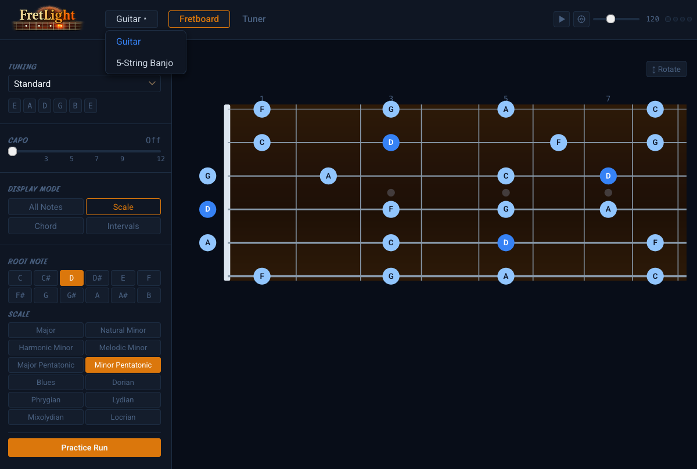

<h1 align="center">FretLight</h1>
<p align="center">A musical instrument trainer and theory app built for the fretboard.</p>



## Features

- **Multi-instrument support** — Guitar and 5-string Banjo, with extensible configs
- **Alternate tuning library** — One-click load for common open tunings (DADGAD, Open G/E, Banjo Open G/D, Double C, Sawmill)
- **Fretboard visualizer** — SVG fretboard with realistic rosewood look, dot inlays, and four display modes:
  - All Notes
  - Scale visualizer (major, minor, pentatonic, modes, blues, and more)
  - Chord tone overlay
  - Interval trainer — click any root note, highlight all occurrences of an interval
- **Capo simulator** — Shift the fretboard and recalculate note names for any capo position (0–12)
- **Chromatic tuner** — Real-time pitch detection from microphone with cents deviation display
- **Metronome** — Precise Web Audio API scheduling, time signatures, tap tempo

## Tech Stack

- [SvelteKit](https://kit.svelte.dev/) + TypeScript
- [Tonal.js](https://github.com/tonaljs/tonal) — music theory
- Web Audio API — tuner & metronome
- [Vercel](https://vercel.com/) — deployment

## Getting Started

```bash
# Install dependencies
npm install

# Start dev server
npm run dev

# Build for production
npm run build

# Preview production build
npm run preview
```

## Deploy

This project is configured for Vercel via `@sveltejs/adapter-vercel`.

```bash
# Deploy with Vercel CLI
vercel
```

Or connect your GitHub repo to Vercel for automatic deployments.

## Project Structure

```
src/
├── lib/
│   ├── music/          # Music theory (notes, scales, chords, intervals, fretboard)
│   ├── instruments/    # Instrument configs and tuning presets
│   ├── audio/          # Web Audio API — tuner and metronome
│   ├── stores/         # Svelte 5 rune-based reactive state
│   └── components/     # Svelte components
└── routes/             # SvelteKit pages
```

---

*Built with care for players who want to understand their instrument, not just memorize shapes.*
